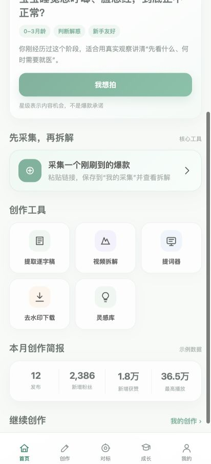

# 芽芽星球工作台

芽芽星球工作台 V1.2 产品、研发交接资料与 Android 离线交互 Demo。

## 快速下载

- Android APK：[`releases/芽芽星球工作台-demo-v1.2.apk`](releases/芽芽星球工作台-demo-v1.2.apk)
- V1.2 完整交接包：[`releases/芽芽星球工作台_完整研发交接包_V1.2.zip`](releases/芽芽星球工作台_完整研发交接包_V1.2.zip)
- 完整产品与技术需求：[`docs/芽芽星球工作台_V1.2_产品设计与前后端完整需求.docx`](docs/芽芽星球工作台_V1.2_产品设计与前后端完整需求.docx)
- 前后端研发矩阵：[`docs/芽芽星球工作台_V1.2_前后端研发需求矩阵.xlsx`](docs/芽芽星球工作台_V1.2_前后端研发需求矩阵.xlsx)

## 仓库结构

```text
android-demo/  Android WebView Demo 源码与本地构建脚本
docs/          PRD、研发矩阵、Markdown 真值源与来源合并说明
releases/      可直接安装的 APK 与完整交接压缩包
```

## Android Demo

- 包名：`com.yayaplanet.workbench`
- 版本：`1.2-demo`（versionCode 12）
- 最低系统：Android 7.0 / API 24
- 目标系统：Android 15 / API 35
- APK SHA-256：`d194f09b768adf4455ad4c2a5689378c1a4da15cddd78676856a86c0281a5d86`

本地构建：

```bash
cd android-demo
./build-apk.sh
```

构建脚本需要 Android SDK 35 Build Tools 和 JDK 17。仓库不包含 Android SDK、签名私钥或临时构建产物。

## 重要边界

当前 APK 是离线产品确认 Demo。采集、逐字稿、视频拆解、AI 生成、课程和统计均使用本地模拟或历史快照，不访问真实抖音、小红书、飞书、AI 或公司后端。

正式版架构和接口以 `docs/` 中 V1.2 文档为准：业务数据使用 Postgres 与对象存储，采集、转写和分析通过异步任务与 Worker 处理。

## 界面预览


