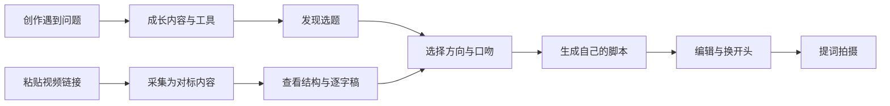

# 芽芽星球工作台

面向母婴内容创作者的一站式创作工作台：帮创作者从“刷到一条值得学的视频”，走到“看懂、改成自己的版本、完成拍摄准备”。

> 当前仓库交付的是 V1.2 产品确认 Demo、Android 源码和完整研发文档。Demo 可离线安装体验；采集、转写、AI 生成和数据均为本地模拟或历史快照，尚未连接正式后端。

## 它解决什么问题

母婴创作者经常遇到四类问题：不知道拍什么、看见爆款却不会拆、写出的内容不像自己、拍摄时仍要反复看稿。芽芽星球把分散的找选题、采集、拆解、写稿和提词动作串成一个工作流。

| 创作场景 | 过去的问题 | 芽芽星球的做法 |
| --- | --- | --- |
| 不知道拍什么 | 选题靠临时灵感 | 给出分星级选题、适配理由和风险边界 |
| 刷到值得学的视频 | 收藏后很少再看 | 采集为对标内容，保留来源、时间和指标快照 |
| 不会拆爆款 | 只能模仿表面文案 | 拆出开头钩子、内容结构、学习点和逐字稿 |
| 写不出自己的版本 | 套模板容易串稿 | 按来源内容 × 创作方向 × 表达口吻生成草稿 |
| 拍摄准备慢 | 写稿与拍摄割裂 | 草稿编辑、换开头、撤销和三档提词器连成闭环 |

## 核心产品闭环



## Demo 里可以体验什么

- 首页：今日选题、核心采集入口、创作工具和创作简报。
- 创作：选题库、方向与口吻配置、真实换组三开头、脚本编辑、撤销和提词器。
- 对标：我的采集、芽芽精选、历史快照、内容结构与逐字稿。
- 成长：按创作问题筛选课程、案例、清单和工具。
- 我的：保存创作者资料，并在本机重启后继续保留。
- 医疗安全：高风险选题只提供记录与就医沟通框架，不输出诊断和用药建议。


## 下载和运行

### 直接在 Android 手机体验

1. 下载 [`芽芽星球工作台-demo-v1.2.apk`](downloads/v1.2/芽芽星球工作台-demo-v1.2.apk)。
2. 在手机中临时允许当前文件管理器或浏览器“安装未知应用”。
3. 安装并打开“芽芽星球工作台”。

最低支持 Android 7.0（API 24），包名为 `com.yayaplanet.workbench`，版本为 `1.2-demo`。

### 本地构建 Android Demo

```bash
git clone https://github.com/zhanglongfeng27101797/yayaxingqiu.git
cd yayaxingqiu/android-demo
./build-apk.sh
```

构建环境需要 JDK 17、Android SDK 35 和 Build Tools 35.0.0。仓库不包含本地 SDK、签名私钥和临时构建目录。

## 项目价值

- 对创作者：减少从灵感到可拍脚本之间的重复劳动，同时保留个人经历和表达方式。
- 对运营：选题、精选内容、成长内容和风险规则可以形成统一运营资产。
- 对研发：产品范围、数据模型、API、状态机、埋点和验收标准已经拆分，可直接进入评审和任务认领。
- 对公司：把一次性采集表升级为可持续积累的内容资产与创作闭环。

## 文档导航

- [文档总目录](docs/README.md)
- [完整产品需求](docs/product/full-product-spec.md)
- [用户流程与页面地图](docs/product/user-flows.md)
- [系统架构](docs/technical/architecture.md)
- [数据模型](docs/technical/data-model.md)
- [API 契约](docs/technical/api-contract.md)
- [研发需求与分工](docs/delivery/requirements-and-ownership.md)
- [测试、发布与验收](docs/delivery/acceptance-and-release.md)
- [可下载交付物](downloads/README.md)

