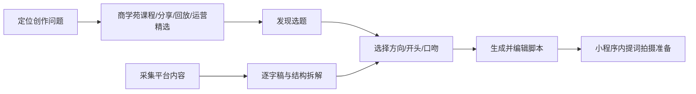

# 芽芽星球工作台

芽芽星球工作台是面向公司签约宝妈创作者的 **微信小程序创作工作台**。产品帮助用户完成“今天拍什么 → 找对标 → 看懂结构 → 变成自己的版本 → 写脚本 → 提词拍摄 → 学习提升”的完整闭环。

> **正式产品平台：微信小程序。**
> 当前仓库中的旧 Flutter / Android Demo、旧 APK/WebView 代码只作为历史参考，不再作为正式前端技术路线或需求真源。

## 新同事先看这 3 件事

1. **正式前端在 `apps/miniprogram/` 开发**；`apps/mobile/` 禁止继续新增正式业务。
2. **文档描述的是目标规格，不等于仓库里的代码已经实现。** 当前真实完成度先看 [`current-implementation-status.md`](docs/delivery/current-implementation-status.md)。
3. 历史 Demo 在 [`reference/demo-v1.0/`](reference/demo-v1.0/README.md)，只能参考视觉/早期交互；其中已知错误不得照搬。

## 产品目标

芽芽星球主要解决四类高频问题：

1. 不知道今天拍什么；
2. 刷到爆款但不会采集、拆解和二创；
3. AI 写出来不像自己，缺少可控的方向、开头和口吻选择；
4. 不知道自己当前应该学什么、怎么继续提升。

三条核心业务闭环：



## 固定底部导航

**首页｜创作｜对标｜成长｜我的**

- 首页：今天值得拍、采集爆款主入口、创作简报、常用工具、继续创作、商学苑推荐。
- 创作：选题 → 方向 → 3 个开头 → 口吻 → 脚本 → 提词器。
- 对标：采集爆款、我的采集、芽芽精选、拆解、逐字稿、变成我的版本。
- 成长：芽芽星球商学苑。不是作业/评级中心，承载课程、分享、直播回放、运营精选、平台规则等。
- 我的：账号、创作资料、权益、消息、设置。**不出现专属运营老师、陪跑老师、陪跑服务。**

## 正式技术方向

| 层级 | 技术方向 | 职责 / 当前状态 |
| --- | --- | --- |
| 小程序前端 | 微信原生小程序 + TypeScript（默认） | 正式前端；`apps/miniprogram` 当前待 M0 初始化 |
| API / BFF | TypeScript / Fastify | 已有骨架，部分路由仍是 Mock/空数据/503，不代表已完成 |
| 异步任务 | TypeScript Worker | 目标架构已定义，真实 Worker 尚未初始化 |
| 数据 | PostgreSQL + 对象存储 | 模型已定义，真实 schema/migration/存储接入尚未完成 |
| 运营后台 | Web（后续） | 规划项，不属于当前 V1 前端交付 |

> 如果前端团队已有成熟 Taro / uni-app 工程体系，可以在 **M0 技术评审**后替换“小程序实现层”；一旦确定必须更新架构决策并冻结，不能在正式工程里同时混用多套框架，更不能回到 Flutter App 方向。

## 仓库结构

```text
apps/miniprogram/          微信小程序正式前端入口（M0 待初始化）
apps/mobile/               历史 Flutter 原型（只读参考，不再新增业务）
reference/demo-v1.0/       历史 APK/WebView Demo 参考与已知偏差说明
services/api/              TypeScript API 骨架
services/worker/           规划中的异步 Worker（当前尚未初始化）
packages/contracts/        共享接口类型、枚举、错误码（当前仅部分完成）
docs/product/              产品范围、页面规格、用户流程
docs/technical/            小程序架构、平台边界、数据与 API
docs/delivery/             范围冻结、当前实现状态、分工、验收与决策
```

> `services/worker/` 目前是**目标目录**而不是已存在实现；不要根据 README 目录图误判完成度。

## 当前研发状态

- 产品平台已冻结为微信小程序。
- `apps/miniprogram/` 已建立正式入口说明，但真实小程序工程尚未初始化。
- 后端 TypeScript 架构可以复用，但现有 `services/api` 只是工程骨架。
- PostgreSQL、对象存储、Worker、微信登录、平台解析、ASR、AI 生成/拆解都需要正式实现。
- 页面规格、范围和 API 目标以 `docs/` 最新文档为准；**完成度**以 `current-implementation-status.md` 和验收结果为准。

## 前端优先阅读

1. [来源与架构决策](docs/delivery/source-and-decisions.md)
2. [V1 范围冻结](docs/delivery/v1-scope-freeze.md)
3. [产品需求](docs/product/product-requirements.md)
4. [完整页面规格](docs/product/page-specification.md)
5. [用户流程](docs/product/user-flows.md)
6. [微信小程序平台边界](docs/technical/wechat-platform-boundaries.md)
7. [当前实现状态](docs/delivery/current-implementation-status.md)
8. [测试与发布](docs/delivery/acceptance-and-release.md)

## 后端优先阅读

1. [来源与架构决策](docs/delivery/source-and-decisions.md)
2. [V1 范围冻结](docs/delivery/v1-scope-freeze.md)
3. [系统架构](docs/technical/architecture.md)
4. [数据模型](docs/technical/data-model.md)
5. [API 契约](docs/technical/api-contract.md)
6. [当前实现状态](docs/delivery/current-implementation-status.md)
7. [研发分工](docs/delivery/requirements-and-ownership.md)

## 产品真源规则

发生冲突不要凭感觉处理，查看 [`source-and-decisions.md`](docs/delivery/source-and-decisions.md) 的分类型裁决规则。

核心原则：

- 范围优先级由 `v1-scope-freeze.md` 决定；
- 页面行为由当前产品需求/页面规格决定；
- API/数据由当前 technical 文档与 contracts 决定；
- **旧代码存在不代表需求正确，路由文件存在不代表功能已完成；**
- 历史 APK/Flutter/WebView Demo 永远不能覆盖正式小程序需求。
