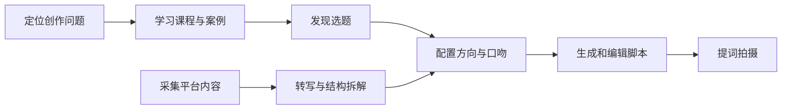

# 芽芽星球工作台

面向母婴内容创作者的内容生产工作台，覆盖选题发现、内容采集、逐字稿、结构拆解、脚本创作和提词拍摄。

## 产品目标

创作者经常遇到“不知道拍什么、收藏后不会拆、套模板不像自己、写完仍难拍”的问题。芽芽星球把分散工具连接为三条业务闭环：



## 技术栈

| 层级 | 技术 | 职责 |
| --- | --- | --- |
| 移动端 | Flutter / Dart | Android 与 iOS 页面、状态管理、接口接入、草稿编辑和提词器 |
| API | TypeScript / Fastify | 鉴权、业务接口、参数校验、幂等和错误契约 |
| 异步任务 | TypeScript Worker | 采集、媒体处理、转写、分析、重试和状态机 |
| 数据 | PostgreSQL + 对象存储 | 业务真值、媒体、逐字稿和版本化分析结果 |

## 仓库结构

```text
apps/mobile/       Flutter 移动端
services/api/      TypeScript API 服务
packages/contracts/共享接口类型与业务枚举
docs/product/      产品范围与用户流程
docs/technical/    架构、数据与 API
docs/delivery/     研发分工、验收与版本决策
```

## 快速开始

### 移动端

```bash
cd apps/mobile
flutter create . --platforms=android,ios
flutter pub get
flutter run
```

### API 服务

```bash
corepack enable
pnpm install
pnpm --filter @yaya/api dev
```

默认 API 地址为 `http://localhost:3000`，可通过 Flutter 的 `--dart-define=API_BASE_URL=...` 覆盖。

## 当前研发状态

- 已建立 Flutter/Dart 移动端工程骨架和五入口应用外壳。
- 已建立 TypeScript API、健康检查、选题、采集任务和脚本生成路由契约。
- 已建立共享 TypeScript 业务类型、统一错误结构和异步任务状态。
- 后续需要接入认证、PostgreSQL、对象存储、平台适配器、ASR 与生成模型。

## 文档

- [产品需求](docs/product/product-requirements.md)
- [用户流程](docs/product/user-flows.md)
- [系统架构](docs/technical/architecture.md)
- [数据模型](docs/technical/data-model.md)
- [API 契约](docs/technical/api-contract.md)
- [研发分工](docs/delivery/requirements-and-ownership.md)
- [测试与发布](docs/delivery/acceptance-and-release.md)
