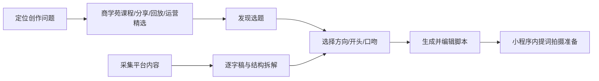

# 芽芽星球工作台

芽芽星球工作台是面向公司签约宝妈创作者的 **微信小程序创作工作台**。产品帮助用户完成“今天拍什么 → 找对标 → 看懂结构 → 变成自己的版本 → 写脚本 → 提词拍摄 → 学习提升”的完整闭环。

> **正式产品平台：微信小程序。**
> 当前仓库中的旧 Flutter / Android Demo 仅作为历史原型与交互参考，不再作为正式前端技术路线。

## 产品目标

芽芽星球主要解决四类高频问题：

1. 不知道今天拍什么；
2. 刷到爆款但不会采集、拆解和二创；
3. AI 写出来不像自己，缺少可控的方向、开头和口吻选择；
4. 不知道自己当前应该学什么、怎么继续提升。

三条核心业务闭环：



## 固定底部导航

**首页｜创作｜对标｜成长｜我的**

- 首页：今天值得拍、采集爆款主入口、创作简报、常用工具、继续创作、商学苑推荐。
- 创作：选题 → 方向 → 3 个开头 → 口吻 → 脚本 → 提词器。
- 对标：采集爆款、我的采集、芽芽精选、拆解、逐字稿、变成我的版本。
- 成长：芽芽星球商学苑。不是作业/评级中心，承载课程、分享、直播回放、运营精选、平台规则等。
- 我的：账号、创作资料、权益、消息、设置。**不出现专属运营老师、陪跑老师、陪跑服务。**

## 正式技术方向

| 层级 | 技术方向 | 职责 |
| --- | --- | --- |
| 小程序前端 | 微信原生小程序 + TypeScript | 页面、组件、状态、登录态、草稿编辑、提词器、任务状态展示 |
| API / BFF | TypeScript / Fastify | 微信登录换取业务会话、业务接口、校验、幂等、错误契约 |
| 异步任务 | TypeScript Worker | 采集、媒体处理、转写、审核、分析、重试和状态机 |
| 数据 | PostgreSQL + 对象存储 | 业务真值、媒体、逐字稿、脚本、版本化分析结果 |
| 运营后台 | Web（后续） | 选题、芽芽精选、商学苑、内容安全和运营配置 |

> 如果前端团队已有成熟 Taro / uni-app 工程体系，可以在技术评审后替换“小程序前端实现层”，但 **产品平台仍固定为微信小程序**，不能再回到 Flutter App 方向。

## 仓库建议结构

```text
apps/miniprogram/          微信小程序正式前端（待前端初始化）
apps/mobile/               历史 Flutter 原型，仅保留参考，后续可归档
services/api/              TypeScript API 服务
services/worker/           异步任务 Worker
packages/contracts/        共享接口类型、枚举、错误码
docs/product/              产品范围、页面规格、用户流程
docs/technical/            小程序架构、数据与 API
docs/delivery/             研发分工、范围冻结、验收与版本决策
```

## 当前研发状态

- 产品平台已冻结为微信小程序。
- 后端 TypeScript / PostgreSQL / Worker 架构可以继续复用。
- 旧 Flutter 工程不作为正式前端实现；前端应在 `apps/miniprogram/` 初始化正式小程序工程。
- 页面规格、状态矩阵和 V1 范围以 `docs/` 最新文档为产品真源。

## 前端优先阅读

1. [产品需求](docs/product/product-requirements.md)
2. [完整页面规格](docs/product/page-specification.md)
3. [用户流程](docs/product/user-flows.md)
4. [V1 范围冻结](docs/delivery/v1-scope-freeze.md)
5. [测试与发布](docs/delivery/acceptance-and-release.md)

## 后端优先阅读

1. [系统架构](docs/technical/architecture.md)
2. [数据模型](docs/technical/data-model.md)
3. [API 契约](docs/technical/api-contract.md)
4. [研发分工](docs/delivery/requirements-and-ownership.md)
5. [V1 范围冻结](docs/delivery/v1-scope-freeze.md)

## 产品真源规则

当历史资料与当前仓库冲突时，按照以下顺序裁决：

**当前 `docs/delivery/source-and-decisions.md` > V1 范围冻结 > 当前产品/技术文档 > 历史 Demo / APK / Flutter 原型 > 更早交接资料。**
