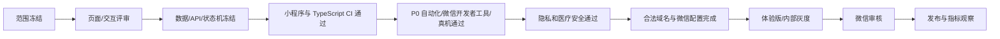

# 测试、发布与验收｜微信小程序 V1

## 小程序 P0

- [ ] TabBar 顺序固定：首页、创作、对标、成长、我的。
- [ ] 对标第 3 位，成长第 4 位（倒数第二）。
- [ ] 首页“采集爆款”视觉权重高于普通工具。
- [ ] 首页“今天值得拍”可进入选题详情和创作配置。
- [ ] 选题切换方向和口吻后，生成结果有明显差异。
- [ ] “换一组开头”返回三个真正的新选项，不是重排旧三句。
- [ ] “换个开头”先三选一，确认后替换，并支持单步撤销。
- [ ] 缺少当前来源字段时明确失败，不出现跨题正文/串稿。
- [ ] 提词器慢/中/快三档、字号、镜像和重置正常。
- [ ] 提词器仅在小程序内运行，不依赖跨 App 悬浮能力。
- [ ] 连续采集 3 条内容后，“我的采集”保留 3 条独立记录。
- [ ] “我的采集”只显示 user_capture；yaya_pick 和 legacy_snapshot 不混入。
- [ ] 爆款拆解详情含逐字稿节选与展开全文。
- [ ] “视频拆解”是独立分析入口，不等同于打开对标库。
- [ ] “提取逐字稿”能走完链接 → 任务 → 结果 → 复制/保存/拆解。
- [ ] 至少一个三星选题可“帮我改成适合宝妈拍”。
- [ ] 成长页标题为“芽芽星球商学苑”，且包含课程之外的分享/回放/运营精选。
- [ ] 成长页不出现作业、签到、积分、评级、陪跑老师。
- [ ] 创作者资料保存后跨页面一致，重新进入小程序仍能恢复。
- [ ] 核心按钮不以统一 Toast 冒充真实交互。
- [ ] 普通远程页面覆盖 loading/success/empty/offline/error。
- [ ] 异步任务覆盖 queued/processing/retriable_failed/failed/cancelled/succeeded。

## 微信平台 P0

- [ ] `wx.login` 能获得 code 并完成服务端业务登录。
- [ ] AppSecret 不存在于小程序代码、构建产物和日志。
- [ ] 正式 API 使用 HTTPS 且已配置小程序合法域名。
- [ ] 测试/生产环境 API 地址可配置，不写死 localhost 到正式构建。
- [ ] 用户从处理页退出/切后台后，采集/ASR/分析任务仍由服务端继续执行。
- [ ] 重新进入小程序后可根据 jobId 恢复任务状态和结果。
- [ ] 隐私相关能力符合微信小程序隐私保护与审核要求。
- [ ] 关键页面在微信开发者工具和至少两台真实微信设备上验证。

## 服务端 P0

- [ ] 未登录、越权、无数据、弱网、超时和第三方限流均有稳定错误码。
- [ ] 重放同一幂等请求不创建重复任务或草稿。
- [ ] 所有读写按 `tenantId + userId` 隔离。
- [ ] 任务只按合法状态转换，重试保留 attempt 和最后错误。
- [ ] Transcript、Analysis 和 Prompt 保存提供方、模型、版本与创建时间。
- [ ] 指标保存采集时间，不把历史快照误表达为实时数据。
- [ ] 日志不包含 Token、AppSecret、session_key、完整正文和不必要隐私字段。
- [ ] 微信 code2Session 只在服务端调用，异常和 code 失效有明确错误码。

## 三条核心链路验收

### A｜今天不知道拍什么

首页 → 今天值得拍 → 我想拍 → 方向 → 开头 → 口吻 → 生成正确脚本 → 编辑 → 去提词 → 调速度并开始滚动。

**失败红线**：任何一步出现核心占位、串稿或选择不影响结果，均视为未通过。

### B｜刷到一个爆款

首页采集爆款 → 粘贴链接 → 创建任务 → 我的采集 → 拆解 → 逐字稿 → 变成我的版本 → 生成脚本。

**失败红线**：连续采集覆盖、我的采集混入历史库、详情无逐字稿，均视为未通过。

### C｜我想学习

成长 → 芽芽星球商学苑 → 选择当前问题 → 推荐立即变化 → 打开课程/分享/回放/运营精选详情。

**失败红线**：成长被做成单纯课程商城或作业中心，视为未通过。

## 发布门禁

## 发布交付物

- 小程序正式工程与构建说明
- 体验版二维码/版本号
- API 与数据库版本
- Worker 版本
- 当前 OpenAPI / contracts
- P0 验收结果
- 已知限制
- 回滚方案
