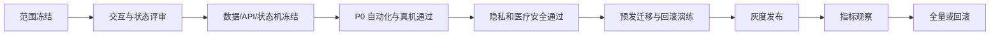

# 测试、发布与验收

## Demo P0 验收

- [ ] 底栏固定为首页、创作、对标、成长、我的，五个入口均可达。
- [ ] 首页采集入口权重大于普通工具。
- [ ] 同一选题切换方向和口吻后，生成结果有明显差异。
- [ ] 换一组开头返回全新三句，选择后替换，并能撤销一次。
- [ ] 夜醒选题不出现辅食正文；缺字段不跨题兜底。
- [ ] 提词器慢/中/快三档速度明显不同，切换立即生效。
- [ ] 连续采集三次产生三个不同 ID；我的采集只显示 `user_capture`。
- [ ] 对标详情显示来源、快照时间、结构、学习点和完整逐字稿。
- [ ] 提取逐字稿与视频拆解分别走完输入、处理、结果和重试流程。
- [ ] 三星发烧选题只生成记录与沟通框架，不提供诊断和用药。
- [ ] 成长标签、内容类型和搜索均可用。
- [ ] 资料保存后首页与“我的”同步，重启仍保留。
- [ ] 所有模拟能力明确标注“演示版”“示例数据”或“历史快照”。

## 正式版接口验收

- [ ] 未登录、越权、无数据、弱网、超时和第三方限流均有明确状态。
- [ ] 创建任务和生成草稿支持幂等，重放请求不生成重复资产。
- [ ] 所有列表和详情按 `tenantId + userId` 隔离。
- [ ] 任务只按合法状态转换，重试保留 attempt 和最后错误。
- [ ] Transcript、Analysis 和 Prompt 均保留版本、模型与创建时间。
- [ ] 日志不包含 Token、完整正文、媒体签名参数和隐私字段。
- [ ] 账号与个人资产删除符合确认、保留和审计策略。

## 非功能要求

| 领域 | 验收重点 |
| --- | --- |
| 兼容性 | Android 7.0+；360–480dp 无关键裁切；触控区不小于 44dp |
| 性能 | 首页、列表和草稿编辑目标由技术评审填写；采集/转写/分析分别监控 P50/P95 |
| 稳定性 | 弱网不丢草稿；任务可恢复；终态不回退；数据库迁移可回滚 |
| 安全 | Token 安全存储、对象签名 URL、租户隔离、限流、医疗风险门控 |
| 可观测性 | requestId、错误码、耗时、失败率、任务积压和第三方限流告警 |

## 发布门禁

Demo 通过只代表产品结构和核心交互确认，不代表采集、ASR、AI、数据持久化和安全能力已经完成。

