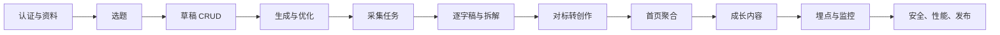

# 研发需求与分工

## P0 范围

| 模块 | 必须交付 | 前端 | 后端 / AI |
| --- | --- | --- | --- |
| 全局导航 | 首页、创作、对标、成长、我的固定顺序 | 路由、状态保留、返回行为 | 首页聚合权限 |
| 选题 | 星级、理由、难度、风险与安全改编 | 列表、详情、筛选和安全提示 | 选题 CMS、有效期、风险规则 |
| 创作 | 来源 × 方向 × 口吻生成，不串稿 | 配置器、编辑、自动保存、换开头、撤销 | 生成服务、Prompt 版本、草稿 CRUD、幂等 |
| 提词器 | 三档速度、字号、镜像和重置 | 完整本地体验 | 无强依赖 |
| 采集 | 链接到任务到结果 | 输入校验、任务状态、失败恢复 | 平台适配、队列、媒体、去重和持久化 |
| 对标 | 来源分区、详情、逐字稿、转创作 | 列表/筛选/详情 | 查询、权限、快照和 Analysis 聚合 |
| 逐字稿 | 独立完整任务 | 任务状态和结果操作 | 下载、ASR、分段、质量分和重试 |
| 视频拆解 | 一句话、钩子、结构、学习点、角度和风险 | 结构化结果页 | Analysis Worker、模型和 Schema 校验 |
| 资料 | 创作资料保存并跨页面同步 | 表单、安全存储和状态同步 | 鉴权、资料 API、租户隔离 |
| 平台能力 | 统一错误、日志、隐私和限流 | 错误组件和埋点 | 网关、审计、监控、限流和删除策略 |

## 角色边界

- 产品：冻结范围、验收口径、医疗安全和版本边界。
- 设计：页面层级、状态、触控区、字号、对比度和核心 SVG 图标。
- 前端：页面、组件、路由、本地编辑、任务状态、错误恢复、埋点和安全存储。
- 后端：鉴权、隔离、数据、异步任务、第三方适配、幂等、审计和安全审核。
- AI/算法：转写和生成契约、模型/Prompt 版本、结构化输出、质量门控和降级。
- 运营：选题、精选、成长内容和风险规则配置。
- 测试：接口契约、状态机、弱网、迁移、回归和 Android 真机。

## 联调顺序

## 里程碑建议

1. M0 工程底座：鉴权、资料、Schema、API 框架和结构化日志。
2. M1 创作闭环：选题、草稿 CRUD、生成、编辑、开头和提词器。
3. M2 采集分析：Worker、媒体、ASR、Analysis 和对标库。
4. M3 内容运营：首页聚合、成长 Feed、搜索和 CMS。
5. M4 上线保障：埋点、监控、灰度、隐私、迁移和真机回归。

需求负责人、迭代和验收状态在项目管理系统中维护；本文件作为 GitHub 内的研发范围与职责基线。
