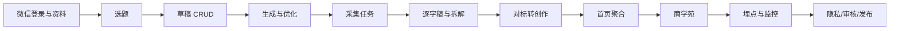

# 研发需求与分工｜微信小程序 V1

## P0 范围

| 模块 | 必须交付 | 小程序前端 | 后端 / AI |
| --- | --- | --- | --- |
| 全局导航 | 首页、创作、对标、成长、我的固定顺序 | TabBar、页面栈、状态保留、返回行为 | 首页聚合权限 |
| 微信登录 | wx.login 到业务会话 | 登录触发、Token/会话使用、失效恢复 | code2Session、用户创建、会话签发、租户隔离 |
| 选题 | 星级、理由、难度、风险与安全改编 | 列表、详情、搜索/筛选、安全提示 | 选题数据、有效期、风险规则、运营配置 |
| 创作 | 来源 × 方向 × 开头 × 口吻生成，不串稿 | 配置器、编辑、自动保存、换开头、撤销 | 生成服务、Prompt 版本、草稿 CRUD、幂等 |
| 提词器 | 三档速度、字号、镜像和重置 | 完整小程序内本地体验 | 无强依赖 |
| 采集 | 链接到任务到结果 | 输入校验、任务状态、离开后恢复、失败重试 | 平台适配、队列、媒体、去重和持久化 |
| 对标 | 来源分区、详情、逐字稿、转创作 | 列表/筛选/详情 | 查询、权限、快照和 Analysis 聚合 |
| 逐字稿 | 独立完整任务 | 任务状态、复制/保存/去拆解 | 下载、ASR、分段、质量分和重试 |
| 视频拆解 | 一句话、钩子、结构、学习点、角度和风险 | 结构化结果页 | Analysis Worker、模型和 Schema 校验 |
| 成长 | 商学苑多内容类型 | 问题标签、推荐、课程/分享/回放/精选列表 | Academy Feed、内容类型、运营配置 |
| 资料 | 创作资料保存并跨页面同步 | 表单、本地暂存和状态同步 | 资料 API、租户隔离 |
| 平台能力 | 统一错误、日志、隐私和限流 | 错误组件、弱网、埋点、隐私授权 | 网关、审计、监控、限流和删除策略 |

## 角色边界

- 产品：冻结范围、页面规格、验收口径、医疗安全和版本边界。
- 设计：微信小程序页面层级、胶囊/安全区、触控区、字号、对比度和核心 SVG 图标。
- 小程序前端：页面、组件、TabBar、页面栈、本地编辑、任务状态恢复、错误恢复、埋点和微信开放能力接入。
- 后端：微信身份换取、业务鉴权、隔离、数据、异步任务、第三方适配、幂等、审计和安全审核。
- AI/算法：转写和生成契约、模型/Prompt 版本、结构化输出、质量门控和降级。
- 运营：选题、芽芽精选、商学苑内容和风险规则配置。
- 测试：微信开发者工具、接口契约、状态机、弱网、前后台切换、迁移、回归和微信真机。

## 前端必须先读

1. `docs/product/product-requirements.md`
2. `docs/product/page-specification.md`
3. `docs/product/user-flows.md`
4. `docs/delivery/v1-scope-freeze.md`
5. `docs/delivery/acceptance-and-release.md`

## 后端必须先读

1. `docs/technical/architecture.md`
2. `docs/technical/data-model.md`
3. `docs/technical/api-contract.md`
4. `docs/product/user-flows.md`
5. `docs/delivery/v1-scope-freeze.md`

## 联调顺序

## 里程碑建议

1. **M0 小程序工程底座**：`apps/miniprogram`、微信登录、环境配置、TabBar、API 客户端、统一错误组件。
2. **M1 创作闭环**：选题、草稿 CRUD、生成、编辑、换开头和小程序内提词器。
3. **M2 采集分析**：Worker、媒体、ASR、Analysis、对标库、逐字稿。
4. **M3 内容运营**：首页聚合、商学苑 Feed、搜索、运营配置基础。
5. **M4 上线保障**：埋点、监控、隐私协议、合法域名、微信审核、灰度和真机回归。

## 协作原则

- 产品需求和接口发生变化，通过 PR 修改仓库文档，不通过聊天口头覆盖真源。
- 前后端对字段理解不一致时，以 API 契约和共享 contracts 为准；契约不足时先补契约再写实现。
- 历史 APK/Flutter 页面只能作为参考，不得以其实现覆盖当前小程序页面规格。
- 需求负责人、迭代和验收状态可在项目管理系统中维护；本文作为 GitHub 内的职责基线。
