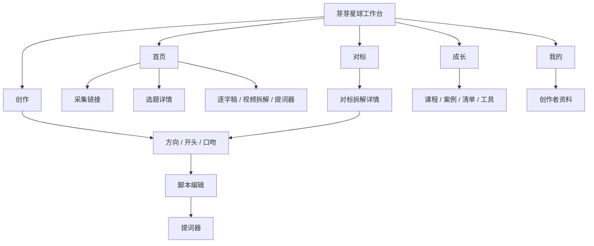
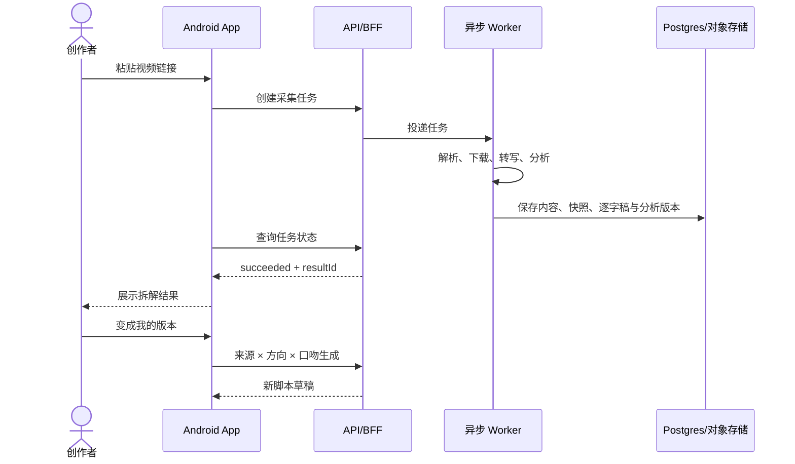

# 用户流程与页面地图

## 导航结构

底部导航顺序固定为：首页、创作、对标、成长、我的。子页面隐藏底栏，通过顶部返回按钮回到来源页面。

## 闭环一：从选题到拍摄

1. 用户从首页或创作选题库进入选题详情。
2. 系统展示星级、为什么值得拍、创作难度、拥挤度和风险边界。
3. 用户选择创作方向、开头和表达口吻。
4. 系统只基于当前来源生成草稿；缺字段时明确报错，禁止跨题串稿。
5. 用户编辑正文、换一组新开头、选择替换并可撤销一次。
6. 用户进入提词器，调整慢/中/快三档、字号和镜像后拍摄。

## 闭环二：从对标内容到自己的版本

Demo 用动画和本地样例模拟上述任务；正式版必须由后端任务状态驱动。

## 闭环三：从创作问题到成长

用户先选择“不知道拍什么、不知道怎么拍、不敢出镜、更新太慢、数据不好”等问题，再查看课程、案例、清单或工具。内容详情说明它解决的问题、学习要点和内容类型，正式版由运营后台配置和审核。

## 所有页面必须覆盖的状态

- `loading`：首次加载或刷新。
- `success`：正常数据。
- `empty`：无采集、无草稿、无课程或无搜索结果，并提供下一步。
- `offline`：网络不可用，保留本地编辑内容。
- `error`：展示用户能理解的错误和是否可重试。
- `processing`：异步任务处理中，显示真实状态而不是伪完成动画。

