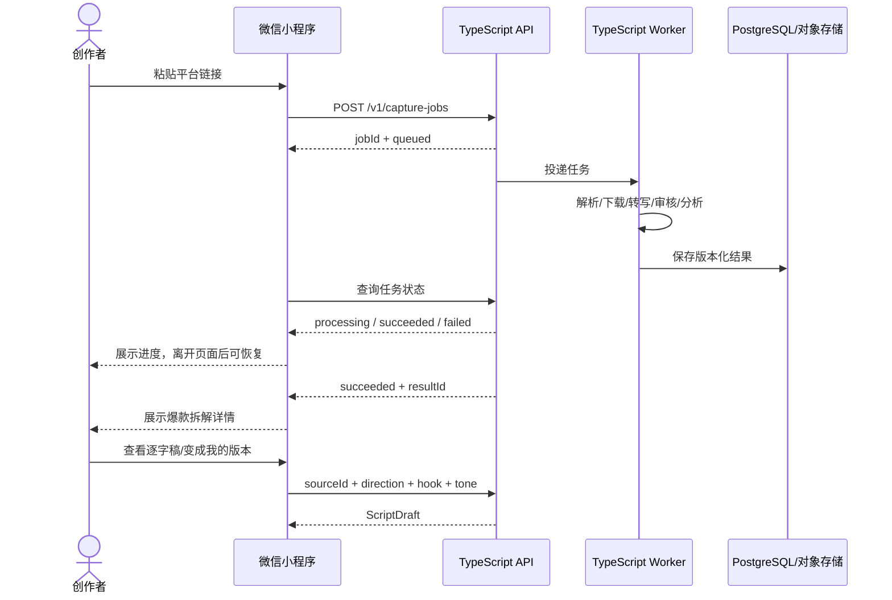

# 用户流程与页面地图｜微信小程序 V1

## 页面地图

```mermaid
flowchart TB
    APP[微信小程序] --> HOME[首页]
    APP --> CREATE[创作]
    APP --> BENCH[对标]
    APP --> GROW[成长]
    APP --> ME[我的]

    HOME --> TOPIC[选题详情]
    HOME --> CAPTURE[采集爆款]
    HOME --> TRANSCRIPT[提取逐字稿]
    HOME --> ANALYZE[视频拆解]
    HOME --> TELE[提词器]

    CREATE --> TOPIC_LIST[选题列表/搜索]
    TOPIC_LIST --> TOPIC
    TOPIC --> CONFIG[方向 / 开头 / 口吻]
    CONFIG --> SCRIPT[脚本编辑]
    SCRIPT --> TELE

    BENCH --> CAPTURE
    BENCH --> BENCH_DETAIL[爆款拆解详情]
    BENCH_DETAIL --> CONFIG

    GROW --> ACADEMY[芽芽星球商学苑]
    ACADEMY --> LEARNING_DETAIL[课程/分享/回放/运营精选详情]

    ME --> PROFILE[创作资料]
    ME --> ACCOUNT[账号绑定]
    ME --> SETTINGS[设置]
```

## 固定 TabBar

**首页｜创作｜对标｜成长｜我的**

- 对标第 3 位。
- 成长第 4 位（倒数第二）。
- 我的第 5 位。

## 流程 A｜从选题到拍摄

1. 用户从首页“今天值得拍”或创作页进入选题详情。
2. 查看推荐理由、星级、可创作性、创作空间、难度、拥挤度、医疗风险和平台风险。
3. 点击“我想拍”。
4. 选择内容方向：推荐 1 个 + 备选 2 个。
5. 选择 3 个开头之一；点击“换一组”必须得到新的 3 个开头。
6. 选择口吻：自然聊天 / 真实经验 / 清楚专业 / 有点冲突。
7. API 根据唯一来源、方向、开头与口吻生成脚本草稿。
8. 用户编辑标题、开头、正文和结尾；可局部优化、换开头、撤销。
9. 草稿自动保存。
10. 用户进入小程序内提词器，调整速度、字号、镜像后拍摄。

## 流程 B｜从采集到二创

### 采集来源规则

- `user_capture`：用户自己采集；进入“我的采集”。
- `yaya_pick`：芽芽精选；进入“芽芽精选”。
- `legacy_snapshot`：历史迁移；只在“全部”中展示并标明历史来源。

## 流程 C｜提取逐字稿

1. 首页点击“提取逐字稿”。
2. 粘贴平台链接。
3. 创建 transcript job。
4. 页面显示处理状态。
5. 成功后展示标题、作者、逐字稿节选与全文。
6. 支持复制全文、保存到对标资产、继续拆解。
7. 用户离开小程序再回来时，通过 jobId 恢复任务状态。

## 流程 D｜视频拆解

1. 首页点击“视频拆解”。
2. 用户可以粘贴链接，或从“我的采集”选择已有内容。
3. 创建/复用分析任务。
4. 成功后直接进入爆款拆解详情。
5. 视频拆解是一次分析任务，不等同于“打开对标库”。

## 流程 E｜成长与学习

1. 进入“成长”。
2. 页面主标题为“芽芽星球商学苑”。
3. 用户选择当前问题：不知道拍什么 / 不会写脚本 / 不会拍视频 / 流量起不来 / 想开始带货。
4. “为你推荐”立即变化。
5. 推荐内容可以来自课程、内部分享、直播回放、运营精选、平台规则、工具教程等。
6. 学习后可回到选题/创作，不引入作业、评级和陪跑老师。

## 流程 F｜我的创作资料

1. 进入“我的”。
2. 编辑创作资料：昵称、创作方向、宝宝年龄、表达风格、是否愿意露脸。
3. 保存后先更新本地页面状态，再同步服务端。
4. 失败时保留用户编辑内容并显示可重试状态。
5. 重新进入小程序后，以服务端资料为业务真值。

## 微信小程序通用状态

所有远程页面必须覆盖：

- `loading`
- `success`
- `empty`
- `offline`
- `error`

异步任务额外覆盖：

- `queued`
- `processing`
- `retriable_failed`
- `failed`
- `cancelled`
- `succeeded`

## 小程序生命周期要求

- 不能假设用户会持续停留在处理页面。
- `onHide` / 关闭小程序后，任务继续由服务端 Worker 执行。
- 用户重新进入时，根据保存的 jobId / resultId 恢复状态。
- 编辑中的草稿需本地暂存，成功同步后以服务端版本为准。
