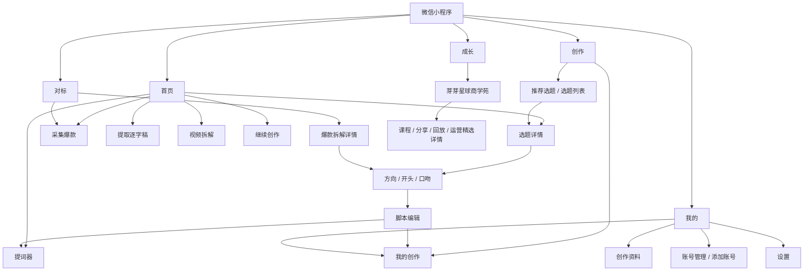

# 用户流程与页面地图｜微信小程序

> 只描述用户怎么用，不规定技术实现。

## 页面地图

## 固定 TabBar

**首页｜创作｜对标｜成长｜我的**

- 对标第 3
- 成长第 4（倒数第二）
- 我的第 5

---

# 流程 A｜今天不知道拍什么

1. 用户打开首页。
2. 看到“今天值得拍”主推荐 1 条 + 另外 2 条。
3. 点击主卡查看选题详情，或直接点击【我想拍】。
4. 选择“这条想怎么讲”：推荐 1 个 + 备选 2 个。
5. 从 3 个开头中选 1 个；不喜欢可【换一组】，必须得到新的 3 个。
6. 选择口吻：自然聊天 / 真实经验 / 清楚专业 / 有点冲突。
7. 点击【生成我的版本】。
8. 进入脚本编辑：标题 / 开头 / 正文 / 结尾 / 拍摄建议。
9. 可做“更口语 / 再短一点 / 更抓人 / 换个开头 / 撤销”。
10. 稿件自动进入“我的创作”。
11. 点击【去提词】。
12. 在小程序提词器调速度 / 字号 / 镜像并开始滚动。

### 失败红线

- 不同选题却生成同一万能正文；
- 方向 / 口吻选择不影响结果；
- 换一组只是原三句换顺序；
- 草稿串稿；
- 提词器速度只有显示、没有真实效果。

---

# 流程 B｜刷到一个爆款，想保存并二创

1. 用户在首页点击【采集爆款】，或在“对标”顶部点击粘贴链接采集。
2. 弹层 / 页面中粘贴链接。
3. 点击【开始采集】。
4. 看到处理状态。
5. 成功后可：
   - 留在“我的采集”；
   - 直接查看拆解。
6. 在“我的采集”中找到该内容。
7. 打开爆款拆解详情。
8. 查看：
   - 一句话看懂；
   - 为什么值得学；
   - 开头为什么抓人；
   - 内容结构；
   - 最值得学的 3 个地方；
   - 逐字稿节选 / 全文；
   - 二创提醒。
9. 点击【变成我的版本】。
10. 继续选择方向 → 开头 → 口吻。
11. 生成脚本。
12. 自动进入“我的创作”。

### 关键规则

- 连续采集 3 条必须保留 3 条；
- “我的采集”只放用户自己采集的内容；
- 历史迁移内容不能混入“我的采集”；
- 爆款详情必须有逐字稿。

---

# 流程 C｜提取逐字稿

1. 首页点击【提取逐字稿】。
2. 粘贴视频链接。
3. 点击【开始提取】。
4. 页面显示处理中。
5. 成功后展示：
   - 标题；
   - 作者；
   - 逐字稿。
6. 支持：
   - 复制全文；
   - 保存；
   - 去拆解。

---

# 流程 D｜视频拆解

1. 首页点击【视频拆解】。
2. 选择：
   - 粘贴新链接；
   - 或从“我的采集”选一条。
3. 进入处理状态。
4. 成功后直接进入爆款拆解详情。

### 关键规则

**视频拆解不等于“打开对标库”。**它是一项独立分析动作。

---

# 流程 E｜我的创作

“我的创作”是一份统一稿件资产库。

来源统一包括：

- 首页推荐生成稿；
- 创作选题生成稿；
- 对标二创稿；
- 后续自定义选题稿。

入口有两个：

- 创作页；
- 我的页。

两个入口必须看到同一份稿件数据。

每条至少可：

- 继续编辑；
- 去提词。

---

# 流程 F｜成长与学习

1. 进入“成长”（Tab 第 4，倒数第二）。
2. 页面主标题：**芽芽星球商学苑**。
3. 用户选择当前问题：
   - 不知道拍什么；
   - 不会写脚本；
   - 不会拍视频；
   - 流量起不来；
   - 想开始带货。
4. “为你推荐”发生变化。
5. 推荐内容可来自：
   - 课程；
   - 内部分享；
   - 直播回放；
   - 运营精选；
   - 爆款复盘；
   - 平台规则；
   - 带货经验；
   - 工具教程。
6. 用户进入学习内容详情。
7. 学完可返回创作。

### 明确不出现

- 作业；
- 打卡；
- 积分；
- 排行榜；
- 强制等级。

---

# 流程 G｜我的资料和账号

1. 进入“我的”。
2. 可进入“我的创作”。
3. 可管理 / 添加账号基础信息。
4. 可编辑创作资料：
   - 昵称；
   - 创作方向；
   - 宝宝年龄；
   - 表达风格；
   - 是否愿意露脸。
5. 保存后重新进入仍保留。
6. 可进入权益、消息、帮助、设置、关于。

### V1 边界

账号管理入口不等于第一版必须接抖音深度 OAuth 或创作中心深层数据。

---

# 页面状态原则

用户可感知状态只需要清楚：

- 加载中；
- 正常；
- 暂无内容；
- 失败；
- 可重试；
- 保存中 / 已保存 / 保存失败。

不要把复杂技术状态术语直接暴露给普通宝妈。
