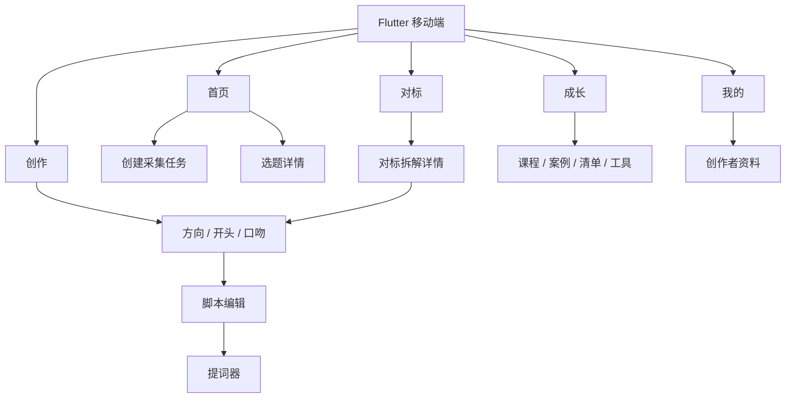
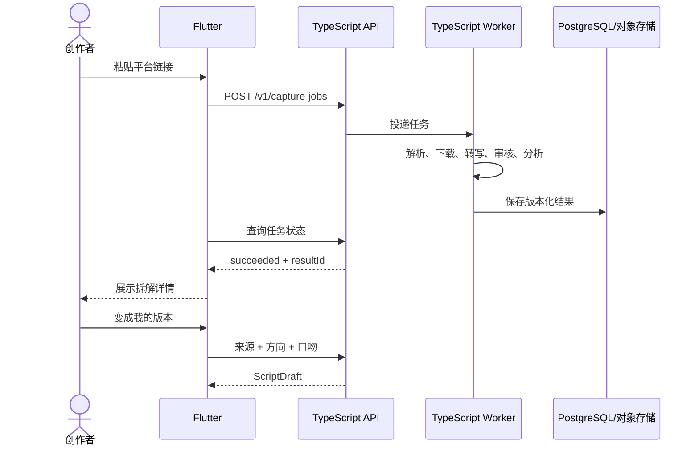

# 用户流程与页面地图

## 从选题到拍摄

1. 用户浏览选题并查看机会、难度和安全边界。
2. 用户选择创作方向、开头和表达口吻。
3. API 根据唯一来源生成脚本草稿。
4. 用户编辑内容、获取新开头、应用并撤销修改。
5. 用户进入提词器，调整速度、字号和镜像后拍摄。

## 从采集到二创

## 页面通用状态

每个远程页面必须覆盖 `loading`、`success`、`empty`、`offline` 和 `error`。任务页面额外覆盖 `processing`、`retriable_failed`、`failed` 和 `cancelled`。

