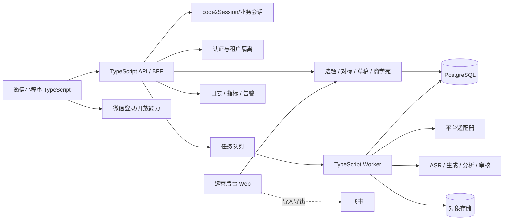
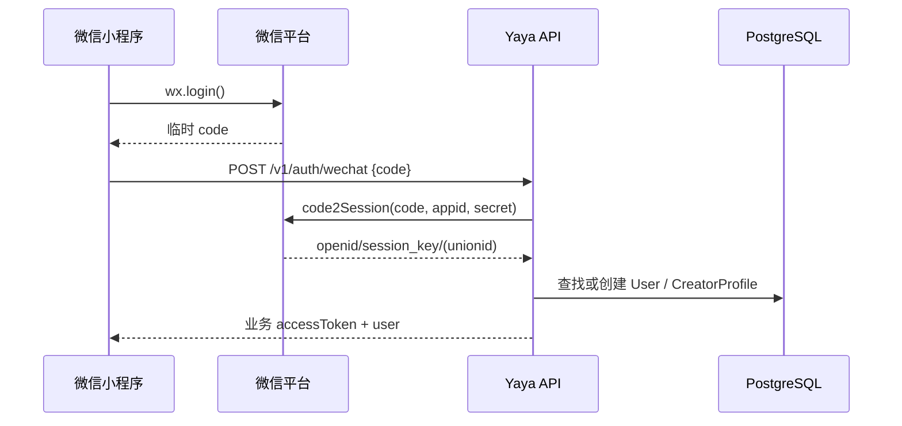
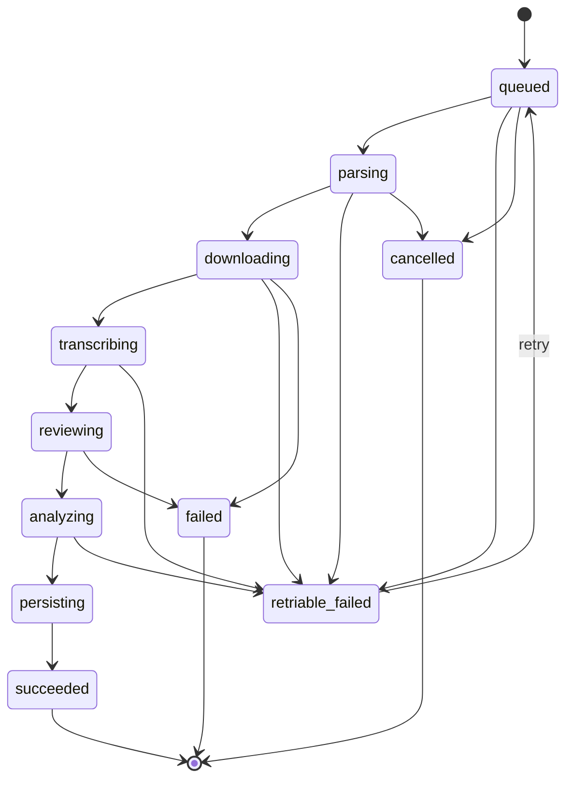

# 系统架构｜微信小程序 V1



## 1. 工程边界

- `apps/miniprogram`：正式微信小程序前端。页面、TabBar、组件、状态管理、微信登录、接口接入、本地草稿、提词器和任务状态恢复。
- `apps/mobile`：旧 Flutter Demo，作为历史原型保留，不再新增正式业务代码。
- `services/api`：HTTP 契约、微信身份换取、业务鉴权、聚合、参数校验、幂等、错误处理和任务创建。
- `services/worker`：链接解析、媒体处理、ASR、审核、分析、AI 生成与重试。
- `packages/contracts`：前后端共享的 TypeScript DTO、枚举、错误结构和任务状态。
- `apps/admin`：后续运营后台，可管理选题、芽芽精选、商学苑、推荐和内容安全。

## 2. 小程序前端技术决策

默认建议：**微信原生小程序 + TypeScript**。

原因：

- 当前正式目标仅微信小程序，不需要为 Android/iOS 跨端付额外复杂度；
- 微信原生生命周期、登录、上传、分享、TabBar、隐私与审核能力适配最直接；
- 项目团队如果已有成熟 Taro/uni-app 标准，可以在技术评审后替换实现层，但不能改变产品平台和接口契约。

### 前端建议目录

```text
apps/miniprogram/
  miniprogram/
    app.ts
    app.json
    app.wxss
    pages/
      home/
      creation/
      benchmark/
      growth/
      profile/
      topic-detail/
      creation-config/
      script-editor/
      teleprompter/
      capture/
      benchmark-detail/
      transcript/
    components/
    services/
    stores/
    utils/
    types/
  project.config.json
  project.private.config.json.example
```

## 3. 微信身份与业务会话

### 登录流程



安全要求：

- `AppSecret` 只能存在服务端环境变量或密钥系统，绝不进入小程序包。
- 小程序不要把 `session_key` 当作业务 Token 返回或长期保存。
- 业务 API 统一使用服务端签发的会话 Token；必要时支持刷新或重新登录。
- 所有数据读写继续以 `tenantId + userId` 隔离。

## 4. 小程序网络与域名

- 所有正式接口使用 HTTPS。
- API、上传、下载相关域名在微信公众平台配置为合法域名。
- 开发环境、测试环境、生产环境分别配置 base URL，不把本地地址写死到正式包。
- 小程序只与自有 API/BFF 交互；第三方平台解析、AI、ASR 密钥由服务端调用。

## 5. 长任务架构

采集、转写、拆解属于异步任务，小程序前端不能承担长时间处理。



任务必须保存：`attempt`、租约、最后错误、开始/结束时间、结果 ID、创建用户和来源。

### 前端恢复机制

- 创建任务后保存 `jobId`。
- 页面显示真实状态，允许用户离开。
- `onShow` 或重新进入相关页面时重新查询状态。
- 成功后跳转结果，不要求用户一直停留在处理页。
- 失败时区分可重试与不可重试错误。

## 6. 本地状态与服务端真值

### 可本地保存

- 编辑中的草稿临时副本
- 未提交的表单
- 最近筛选条件
- 最近任务 ID
- 提词器速度/字号等偏好

### 必须以服务端为准

- CreatorProfile
- Topic
- Benchmark
- Transcript
- Analysis
- ScriptDraft 正式版本
- 商学苑内容
- 用户权益和账号绑定

## 7. 提词器边界

V1 提词器完全在小程序内运行：

- 开始/暂停
- 慢/中/快三档速度
- 字号
- 镜像
- 重置

不做：

- 跨 App 悬浮窗
- 系统级悬浮权限
- 自建相机替代微信/系统相机
- 美颜、滤镜、剪辑

## 8. 文件与媒体

- 封面和媒体统一走受控上传/下载路径。
- 大文件优先由客户端上传至后端指定位置，或使用后端签名上传方案；具体方案由后端按对象存储选型落地。
- 媒体访问使用短期签名 URL 或鉴权代理，不长期暴露原始永久地址。
- 原始平台快照、逐字稿和分析结果保存版本号与采集时间。

## 9. 安全与可观测性

- 所有创建任务和生成草稿接口支持 `Idempotency-Key`。
- 日志记录 requestId、错误码、耗时和必要元数据，不记录 Token、AppSecret、完整正文或不必要隐私。
- 生成、转写、分析保存提供方、模型、Prompt/算法版本与创建时间。
- 内容安全覆盖母婴医疗风险、平台风险和 AI 生成审核。
- 媒体配置生命周期、删除与审计。

## 10. 后端可复用结论

从旧 App 架构迁移到微信小程序时，以下后端设计继续保留：

- TypeScript API / BFF
- PostgreSQL
- 对象存储
- Worker 与队列
- ASR / AI / 分析服务
- SourceType 与异步任务状态机
- 幂等、租户隔离、错误码、版本化结果

需要新增/调整的核心只是：

1. 微信小程序登录与会话接口；
2. 小程序前端接口适配与生命周期恢复；
3. 合法域名、隐私协议、用户授权与微信审核相关工程配置。
