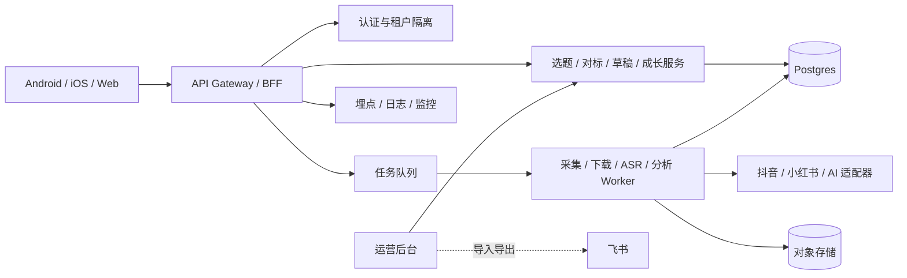
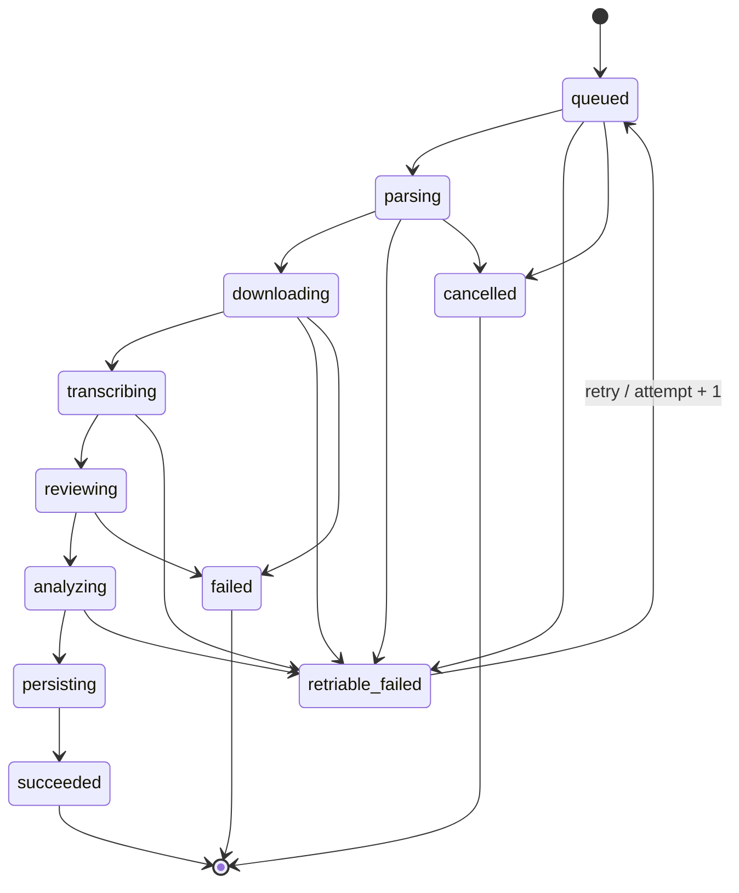

# 系统架构

## Demo 与正式版边界

| 层级 | V1.2 Demo | 正式版 V1 |
| --- | --- | --- |
| 客户端 | Android WebView、本地资源 | Android/iOS/前端应用 |
| 数据 | `localStorage`、示例数据、历史快照 | Postgres 业务真源 |
| 媒体 | 本地静态资源 | 对象存储与签名 URL |
| 采集/转写/分析 | 本地定时动画模拟 | 队列、Worker、第三方适配器 |
| AI 生成 | 本地规则模板 | 版本化 Prompt、模型服务、质量门控 |
| 飞书 | 不访问 | 后台导入导出和运营兼容，不作为在线主库 |

## 正式版目标架构

## 组件职责

- 客户端：页面、导航、本地编辑、错误恢复、安全存储、任务状态展示和埋点。
- API/BFF：认证、输入校验、聚合接口、游标分页、幂等和错误包络。
- 业务服务：用户、选题、对标、草稿、成长内容和权限规则。
- Worker：链接解析、媒体处理、转写、审核、分析、持久化和重试。
- AI 层：Prompt 与模型版本、结构化输出校验、医疗与平台风险门控、降级策略。
- 数据层：Postgres 保存业务结构，对象存储保存媒体和大文本，二者都按租户和用户隔离。

## 异步任务状态机

任务必须保留 `attempt`、最后错误、租约、开始/结束时间和结果 ID；终态不能回退。重复任务使用 `Idempotency-Key` 返回同一资源。

## 安全与可观测性

- Bearer Token 只保存在系统安全存储，日志不记录 Token、完整正文和隐私字段。
- 所有查询以 `tenantId + userId` 作为隔离边界，越权请求返回 403 或不泄漏资源存在性的 404。
- 媒体使用短期签名 URL，并配置生命周期和删除策略。
- 采集、转写、分析和生成记录 requestId、耗时、错误码、模型和版本。
- 医疗高风险内容在生成前后执行规则与模型双重门控。

