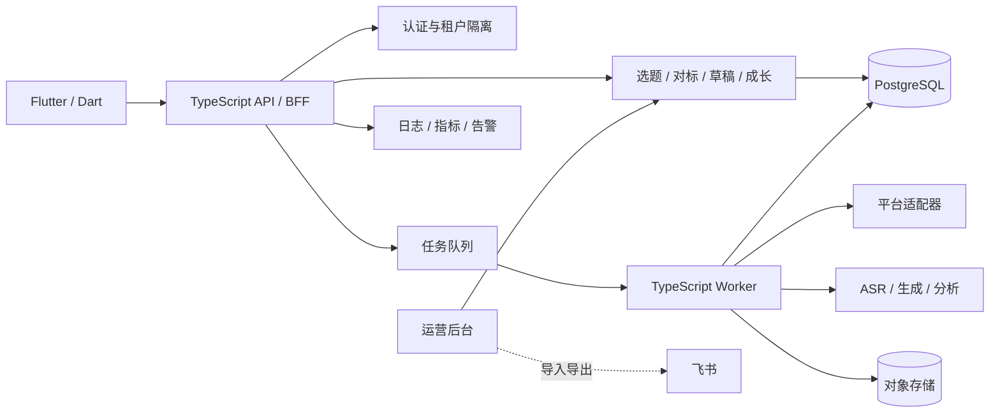
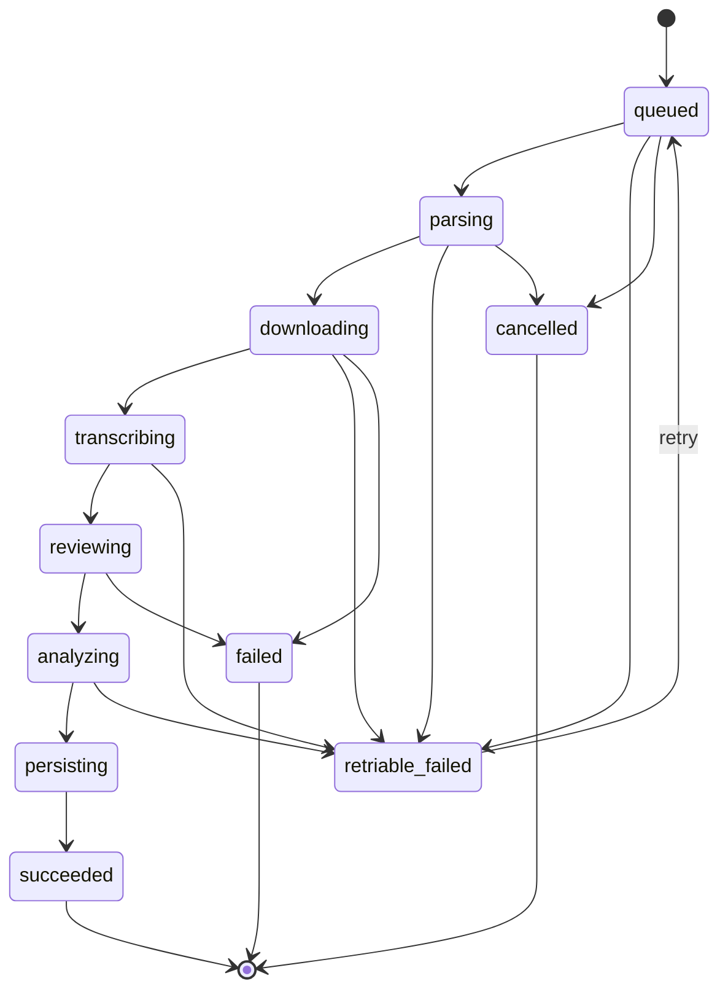

# 系统架构

## 工程边界

- `apps/mobile`：Flutter 页面、导航、状态管理、接口接入、安全存储和本地草稿体验。
- `services/api`：HTTP 契约、鉴权、聚合、校验、幂等、错误处理和任务创建。
- `services/worker`：后续承载链接解析、媒体处理、ASR、审核、分析与重试。
- `packages/contracts`：前后端共享的 TypeScript 契约、枚举和错误结构。

## 异步任务状态

任务必须保存 `attempt`、租约、最后错误、开始/结束时间和结果 ID。终态不能回退，重试必须生成新租约并递增尝试次数。

## 安全与可观测性

- Bearer Token 进入 iOS Keychain 或 Android Keystore。
- 所有查询以 `tenantId + userId` 作为隔离边界。
- 创建任务和生成草稿必须支持 `Idempotency-Key`。
- 媒体使用短期签名 URL，并配置生命周期与删除审计。
- 日志只记录 requestId、错误码、耗时和必要元数据，不记录完整正文和密钥。

