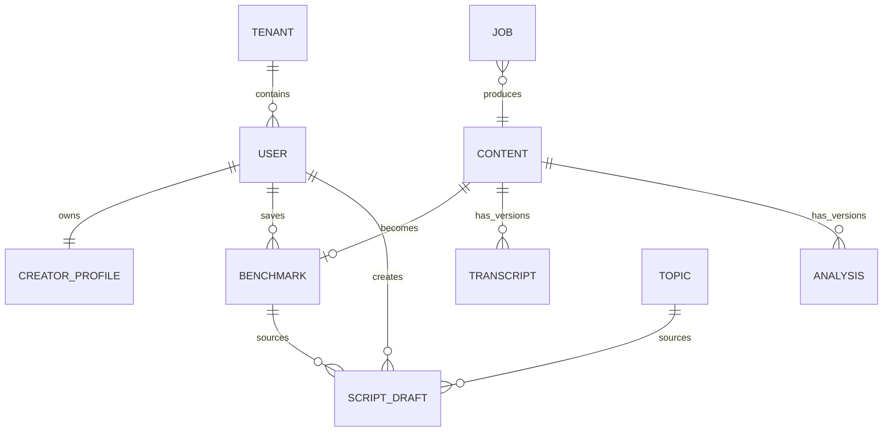
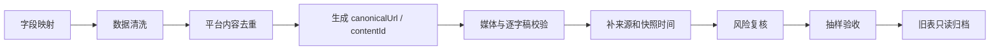

# 数据模型

## 核心关系

## 核心实体

| 实体 | 关键字段 | 说明 |
| --- | --- | --- |
| `CreatorProfile` | userId、tenantId、nickname、creatorDirections、babyAgeStage、tonePreference、willingToAppear | 创作者资料和生成偏好 |
| `Topic` | topicId、title、stars、why、difficulty、medicalRisk、hooksByDirection、contentCore、validFrom/To | 运营审核后的选题资产 |
| `Content` | contentId、platform、platformContentId、canonicalUrl、metrics、capturedAt、extractorVersion | 平台内容统一模型 |
| `Benchmark` | benchmarkId、contentId、sourceType、sourceLabel、structure、stars、learnTags | 用户可见的对标收藏 |
| `Transcript` | transcriptId、contentId、segments、provider、model、qualityScore、createdAt | 不覆盖旧版本的逐字稿 |
| `Analysis` | analysisId、contentId、oneLine、hook、flow、points、angles、riskFlags、promptVersion | 结构化拆解结果 |
| `ScriptDraft` | draftId、sourceType、sourceId、direction、tone、opening、body、ending、version | 与唯一来源绑定的脚本 |
| `AcademyContent` | contentType、problemTags、summary、mediaUrl/body、status、publishedAt | 成长内容资产 |
| `Job` | jobId、type、status、attempt、lease、lastError、resultId | 采集、转写和分析任务 |

## 来源真值

`Benchmark.sourceType` 只能为：

- `user_capture`：用户主动采集，只进入“我的采集”。
- `yaya_pick`：运营精选，只进入“芽芽精选”。
- `legacy_snapshot`：原育咖采集表迁移的只读历史快照，不混入前两类。

每条快照必须显示 `sourceLabel` 和 `capturedAt`，禁止把历史指标展示为实时数据。每次正常采集生成新的 `contentId/benchmarkId`；只有请求携带同一幂等键时才复用资源。

## 生成数据约束

- 草稿必须同时保存 `sourceType + sourceId`，生成只读取该来源。
- 来源缺少生成所需字段时返回明确错误，不能使用其他 Topic 或 Benchmark 的正文兜底。
- `generationMeta` 保存模型、Prompt 版本、输入摘要和风险审核结果，但不保存密钥。
- Transcript、Analysis 和 Prompt 都按版本新增，不能静默覆盖。

## 旧育咖表迁移

