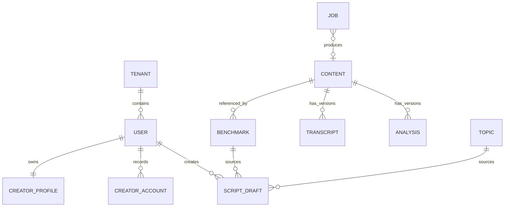
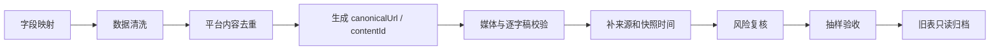

# 数据模型

## 核心关系

> `Benchmark` 不应建模为“一条 Content 最多只能对应一个 Benchmark”。同一平台内容可能被不同用户采集、被运营精选或作为历史快照，因此是 `CONTENT 1 -> N BENCHMARK`。

## 核心实体

| 实体 | 关键字段 | 说明 |
| --- | --- | --- |
| `CreatorProfile` | userId、tenantId、nickname、creatorDirections、babyAgeStage、tonePreference、willingToAppear | 创作者资料和生成偏好 |
| `CreatorAccount` | accountId、userId、platform、displayName、platformUid?、bindingType、status | V1 账号基础信息。P0/P1 不等于第三方 OAuth 深度授权 |
| `Topic` | topicId、title、stars、why、difficulty、medicalRisk、hooksByDirection、contentCore、validFrom/To | 运营审核后的选题资产 |
| `Content` | contentId、platform、platformContentId、canonicalUrl、metrics、capturedAt、extractorVersion | 平台内容统一模型 |
| `Benchmark` | benchmarkId、contentId、ownerUserId?、tenantId、sourceType、sourceLabel、structure、stars、learnTags | 用户采集/运营精选/历史快照的可见对标资产 |
| `Transcript` | transcriptId、contentId、segments、provider、model、qualityScore、createdAt | 不覆盖旧版本的逐字稿 |
| `Analysis` | analysisId、contentId、oneLine、hook、flow、points、angles、riskFlags、promptVersion | 结构化拆解结果 |
| `ScriptDraft` | draftId、sourceType、sourceId、direction、hookId、tone、opening、body、ending、version | 与唯一来源绑定的脚本 |
| `AcademyContent` | contentType、problemTags、summary、mediaUrl/body、status、publishedAt | 成长内容资产 |
| `Job` | jobId、type、status、attempt、lease、lastError、resultId | 采集、转写和分析任务 |

## Benchmark 所有权与来源

`Benchmark.sourceType` 只能为：

- `user_capture`：用户主动采集。`ownerUserId` 必填，只进入该用户“我的采集”。
- `yaya_pick`：运营精选。通常按 tenant 可见，`ownerUserId` 可为空，只进入“芽芽精选”。
- `legacy_snapshot`：原育咖采集表迁移的只读历史快照，按 tenant 可见，不混入前两类。

每条快照必须显示 `sourceLabel` 和 `capturedAt`，禁止把历史指标展示为实时数据。每次正常采集生成新的 `contentId/benchmarkId`；只有请求携带同一幂等键时才复用原任务/资源。

## CreatorAccount V1 边界

V1 的“账号绑定/账号入口”先按基础资料理解：

- 可记录平台、账号名、平台 UID（若用户主动填写）、状态；
- `bindingType` 可先使用 `manual`；
- 不把“展示一个账号入口”解释为已经接入抖音 OAuth、创作中心数据或深层指标；
- 第三方深度授权与数据同步属于 P2，届时再扩展 token/授权状态等模型，并按平台合规要求设计。

## 生成数据约束

- 草稿必须同时保存 `sourceType + sourceId`，生成只读取该来源。
- 选中的 `hookId` 必须进入生成请求/生成元数据，不能只在前端展示而后端忽略。
- 来源缺少生成所需字段时返回明确错误，不能使用其他 Topic 或 Benchmark 的正文兜底。
- `generationMeta` 保存模型、Prompt 版本、输入摘要和风险审核结果，但不保存密钥。
- Transcript、Analysis 和 Prompt 都按版本新增，不能静默覆盖。

## API DTO 与数据库字段命名

- 数据库/领域内部可以使用 `topicId / benchmarkId / draftId` 等明确字段；
- 当前 API DTO 对普通资源统一使用 `id`，任务资源使用 `jobId`；
- 前后端不要因为数据库字段名不同而自行改变 API；以 `api-contract.md` / `packages/contracts` 为准。

## 旧育咖表迁移

